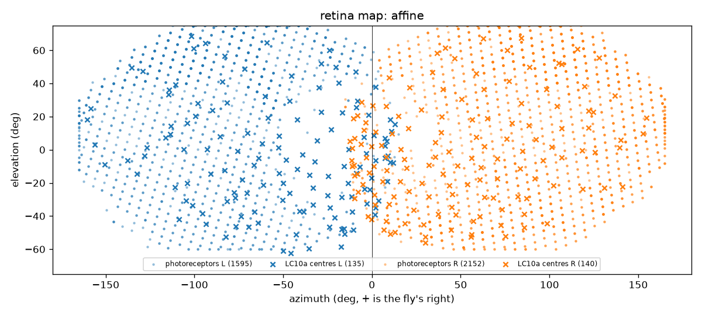

# flycraft M1 report

- generated: 2026-10-07T21:00:59+00:00
- wiring: REAL WIRING (`60cdd04e254bb6b0`)
- device: cuda (NVIDIA GeForce RTX 5080), dtype float32
- speed: 4.975 s wall per simulated second
- result: PASS on rung vpn

## Connectome

| | ours | drosophila-brain-mlx |
|---|---|---|
| neurons | 164,587 | 166,700 |
| edges | 25,563,197 | 24,469,412 |

Synapses 124,025,046; self-loops 101; annotated bodies with a superclass 166,700; edges whose presynaptic consensus NT is ACh/GABA/Glu 24,458,434.

Transmitters: acetylcholine 104,030, glutamate 29,616, gaba 22,108, histamine 5,918, unknown 2,012, dopamine 395, serotonin 375, octopamine 133.

## Sign rule

Inhibitory here: gaba, glutamate, histamine. Shiu et al. 2024 stated rule: gaba, glutamate (their code uses precomputed FlyWire signs, which have no histamine).
Differences: 5,918 neurons, 81,800 edges.

- histamine: 5,918 neurons, 81,800 edges (ours -1, Shiu +1)

## Retina map

Map: **affine** (fits pass). Photoreceptors 4,102, unassigned 355. R1-R6 L 498 / R 888; R7/R8 L 1,097 / R 1,264. LC10a with a field 275, without 0.



## Calibration ladder

| rung | G0 w_scale | z LC10a | z DNa02 | G1 |
|---|---|---|---|---|
| default | 1 | 0 | 0 | fail |
| flip_polarity | 1 | 0 | 0 | fail |
| tonic_20 | 1 | 0 | 0 | fail |
| tonic_50 | 1 | 0 | 0 | fail |
| vpn | 0.8438 | 126.8 | 4.424 | pass |

Rung **vpn** passed. Mean rates (Hz) by spot azimuth:

| azimuth | LC10a L | LC10a R | DNa02 L | DNa02 R |
|---|---|---|---|---|
| -60.0 | 3.48 | 0.00 | 18.07 | 0.00 |
| 0.0 | 5.77 | 6.46 | 1.00 | 0.13 |
| 60.0 | 0.00 | 2.85 | 1.20 | 9.20 |

G0 probes for this rung:

| w_scale | mean Hz | % over 100 Hz | runaway |
|---|---|---|---|
| 1 | 6.62 | 3.065 | True |
| 0.5 | 0.05 | 0.009 | False |
| 0.75 | 0.09 | 0.009 | False |
| 0.875 | 5.55 | 1.828 | True |
| 0.8125 | 0.10 | 0.009 | False |
| 0.8438 | 0.13 | 0.009 | False |

## Brain-chain chirality

Descending output for a spot on the right: turns toward the spot (z +4.42).

## Decoder calibration

```json
{
  "b_turn": 0.0,
  "b_fwd": 0.0,
  "k_turn": 4.493677216147349,
  "k_fwd": 0.0,
  "turn_silent": false,
  "fwd_silent": true,
  "p95_turn_hz": 40.056281602336114,
  "p95_fwd_hz": 0.005871259654711501
}
```
